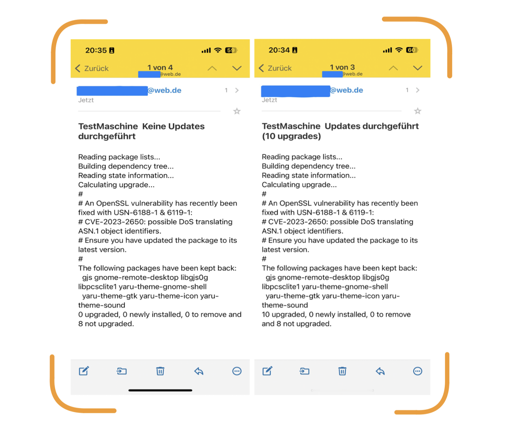

    --------- Update_notification ---------
    
    Computer, Server etc. bieten dem Nutzer eine Vielzahl von Möglichkeiten. 
    Damit die Funktionalitäten gewährleistet sind ist die Sicherheit ein elementarer Bestandteil.
    Regelmäßige Updates bieten eine wichtige Basis der Sicherheit.
    Darüber hinaus möchte ich als Nutzer darüber informiert sein, ob meine Systeme auf dem
    aktuellsten Stand sind und ob es Probleme gibt, ohne manuell nachschauen zu müssen.
    Die Funktion der automatischen Updates mit Email-Benachrichtigungen richtet sich an Server
    die rund um die Uhr angeschaltet sind.

    ----- Funktion -------------
    
    -> automatisierte Updates
    -> Email-Benachrichtigung über Update-Status
        - pro System kann ein Name gewählt werden
        - in der Email ist direkt ersichtlich welches System ob und was geupdatet wurde
    
    ==> Ziel: Übersicht über den Update-Status aller Systeme

    
    ----- Ablauf --------------

    
    -> Bash-Skript mit "sudo"-Rechten starten
    -> requirements.txt wird installiert
    -> Absender-Email (Web.de) wird in send_email.py eingetragen
    -> Absender-Email (Web.de) PW wird in send_email.py eingetragen
    -> Empfänger-Email wird eingetragen
    -> "full-upgrade -y" wird durchgeführt, in updates.txt geschrieben und in die Email eingelesen 
    -> Test-Email wird versendet
    -> die Updates und Emails werden mit einem Root-Cronjob durchgeführt und versendet
    -> Minuten, Stunden, Tage etc. eintragen
    -> Cronjob wird in Crontab eingetragen (nachprüfbar mit: crontab -e)

    
    ----- Sonstiges -----------
    -> Benachrichtigungen mit Web.de?
        - Gute Anbindung mit der Web.de-App für mein Smartphone
        - einfache Umsetzung
        - Web.de ist vergleichsweise vertrauenswürdig und verschlüsselt die Emails
        => Andere Email-Dienste als Absender erfordern eine Anpassung der SMTP-Server-Daten

        
    -> Warum keine Module wie Pushover oder Pushjet etc.
        - keine gute App-Anbindung an Smartphones
        - keine praktikable Umsetzung möglich
        - keine Garantie für eine Kompatibilität bei zukünftigen IOS- / Android-Versionen
        - keine Sicherheit in der Stabilität der Anwendungen

